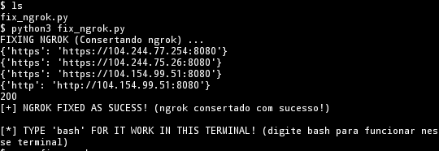
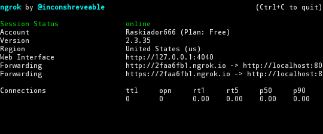

Fix Ngrok (version v 1.0)
===============================

Usage :
      
      $ apt-get install python3
      $ apt-get install git
      $ git clone https://github.com/f1gur4nt1/fix_ngrok
      $ cd fix_ngrok
      $ chmod 700 fix_ngrok.py
      $ python3 fix_ngrok.py

  

    
How you can see, ngrok are working!

Testado em:
      Termux 
 
